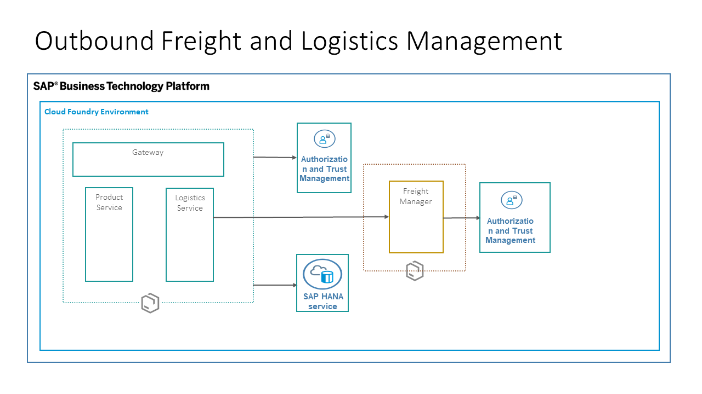
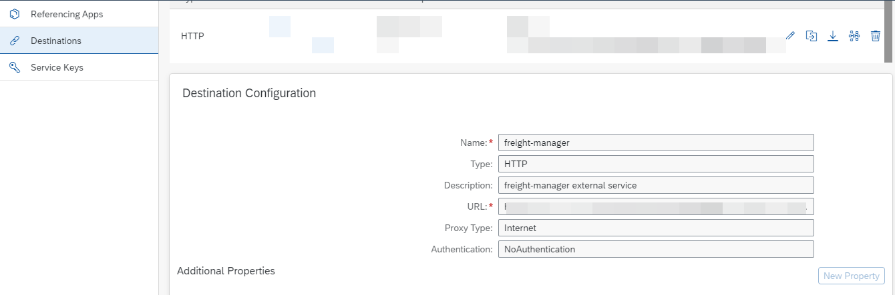

# Outbound Freight and Logistics Management
This is a reference application built to showcase the features of Authorization and Trust Management Service. The current scope of the application is to showcase the below features. 
- Authentication and Authorization of users
- Secured communications by Propagating a Business User
- Secured Communication using a Technical user

These features are showcased through an Outbound Freight and Logistics Management Application. This application is based on a shipment order creation for a freight. As a supplier he gets different quotations for different modes of transport and he chooses the best available quotation as per his needs. And you will also learn how to create scalable services using SAP Cloud SDK and Nest.js framework.

# Table of content
- [Outbound Freight and Logistics Management](#outbound-freight-and-logistics-management)
- [Table of content](#table-of-content)
- [Architecture](#architecture)
    - [SAP Cloud Platform Cloud Foundry Enviornment](#sap-cloud-platform-cloud-foundry-enviornment)
    - [Product Service](#product-service)
    - [Logistics Service](#logistics-service)
    - [External Freight Manager](#external-freight-manager)
    - [Authorization and Trust Management in the Cloud Foundry Environment](#authorization-and-trust-management-in-the-cloud-foundry-environment)
    - [HANA Database](#hana-database)
    - [SAP Cloud SDK for JavaScript](#sap-cloud-sdk-for-javascript)
    - [NestJS](#nestjs)
- [Requirements](#requirements)
- [Security Implementation](#security-implementation)
  - [Propagating a Business User](#propagating-a-business-user)
  - [Using a Technical User](#using-a-technical-user)
  - [Implementing Authentication and Authorization](#implementing-authentication-and-authorization)
    - [Business User Implementation](#business-user-implementation)
    - [Technical User Implementation](#technical-user-implementation)
- [Deploying the application on SAP Cloud Foundry](#deploying-the-application-on-sap-cloud-foundry)
- [Deploying the applications](#deploying-the-applications)
  - [Deployment Using Manifest](#deployment-using-manifest)
  - [Deployment using MTA](#deployment-using-mta)
- [Common issues during deployment and their resolutions](#common-issues-during-deployment-and-their-resolutions)
- [Swagger](#swagger)


# Architecture


In the above diagram we have the following components: 
- SAP Cloud Platform Cloud Foundry Enviornment 
- Product Service
- Logistics Service
- Freight Manager
- Authorization and Trust management
- HANA Database 

### SAP Cloud Platform Cloud Foundry Enviornment 
The SAP Cloud Foundry environment allows you to create microservices based cloud applications in SAP Cloud Foundry. It contains the SAP Cloud Platform Application Runtime service, which is based on the open-source application platform managed by the Cloud Foundry Foundation.[Read More](https://help.sap.com/viewer/3504ec5ef16548778610c7e89cc0eac3/Cloud/en-US/9c7092c7b7ae4d49bc8ae35fdd0e0b18.html)

### Product Service
This service can be used to process products and stock information.

### Logistics Service
This service communicates securely with the Product Service(via a Business User Propagation) and then consolidates the characteristics of the goods to be shipped. Then communicates securely with the freight manager service which is an external service(via Technical User Communication) and gets a quotation for the shipment.

### External Freight Manager
This is a service external to the application which is used to calculate the shipment costs using a simple logic.
This service is also used in showcasing the app-to-app communication between two microservices deployed in the same subaccount, but bounded to two different Authorization and Trust Management services. For more information, see referencing the application in the documentation for SAP Cloud Platform.

### Authorization and Trust Management in the Cloud Foundry Environment
The global account and subaccounts get their users from identity providers. Administrators make sure that users can only access their dedicated subaccount by making sure that there is a dedicated trust relationship only between the identity providers and the respective subaccounts. Developers configure and deploy application-based security artifacts containing authorizations, and administrators assign these authorizations using the cockpit.[Read More](https://help.sap.com/viewer/65de2977205c403bbc107264b8eccf4b/Cloud/en-US/6373bb7a96114d619bfdfdc6f505d1b9.html)

### HANA Database
SAP HANA is a high-performance in-memory database that accelerates data-driven, real-time decision-making and actions, and supports all workloads, with the broadest advanced analytics on multi-model data, on premise and in the cloud.[Read more](https://www.sap.com/products/hana.html)

### SAP Cloud SDK for JavaScript
The SAP Cloud SDK supports you end-to-end when developing applications that communicate with SAP solutions and services such as SAP S/4HANA Cloud, SAP SuccessFactors, and many others.

Using the SDK, you can reduce your effort when developing an application on SAP Cloud Platform by building on best practices delivered by the SDK. The SDK can provide JavaScript libraries and project templates.

To create such an application we provide a command line interface, that allows you to scaffold or enhance an application with the missing parts to use the SDK.[Read More](https://sap.github.io/cloud-sdk/docs/js/getting-started/)

### NestJS

NestJS is a progressive [Node.js](http://nodejs.org) framework for building efficient and scalable server-side applications, heavily inspired by [Angular](https://angular.io). 

The [Nest CLI](https://docs.nestjs.com/cli/usages) is a powerful tool and can help you create new controllers, modules and interfaces.


# Requirements
- [SAP CLOUD SDK](https://sap.github.io/cloud-sdk/docs/js/getting-started/)
- [Cloud Foundry CLI](https://github.com/cloudfoundry/cli#downloads)
- SAP Cloud Platform Global account
- 2- XSUAA instances
- 1 HANA DB instance
- 1 HDI Container instance

# Security Implementation

The security implementation in the application is using the Node-security libraries which can be integrated with the SAP Cloud Platform Authorization and Trust Management service as described [here](https://help.sap.com/viewer/65de2977205c403bbc107264b8eccf4b/Cloud/en-US/4902b6e66cbd42648b5d9eaddc6a363d.html). This Application implements app-to-app communication so that two microservices can securely communicate with each other. This application showcases how to implement a secure communication using two  different ways:

- Propagating a Business User
- Using a Technical User

## Propagating a Business User

In this approach, the business user is authenticated and his authorizations are used to call another microservice. The user is therefore known to the microservice that he is calling.

## Using a Technical User

In this approach, a technical user is used to access data from another microservice. The called microservice grants the calling application the necessary rights without identifying a user.


Both methods have their use cases, depending on whether or not you need to identify the business user and grant access based on his authorizations or using a technical user is sufficient.


## Implementing Authentication and Authorization

The steps below describe how authentication and authorization is implemented in the ESPM application.

### Business User Implementation

As a pre prerequisite, the logistics-service and product-service should be bound to same xsuaa instance.

 1. Add the [application security descriptor](https://help.sap.com/viewer/65de2977205c403bbc107264b8eccf4b/Cloud/en-US/150b04d647cd4b42835411c1787a8b11.html) file (xs-security.json) to the project.
    > This file can be found in the root folder of the project.

 2. Define a role **Supplier** within the application security descriptor.
    
    Only a person assigned the **Supplier** role will be able to create a Shipment Order.

 3. Configure scope checks for validating jwt tokens.
 
    This is done in the logistics-service and product-service by using passport and xssec packages(https://help.sap.com/viewer/65de2977205c403bbc107264b8eccf4b/Cloud/en-US/dbd4c69eef5642d4a2ced0f6fc7a0415.html).
 
 4. Implement app-to-app communication for the business user in the getQuote method of Product Service.

 When a Supplier logs in to create a shipment order order, the business user is propagated from the logistics-service to product-service for a stock check before accepting the shipment order. This ensures that enough stock is available before a shipment order is accepted and only a user with the **Supplier** role has the permission to do a stock check.
 
 ### Technical User Implementation
 
 App-to-app communication for the technical user is implemented between the logistics-service and the freight-manager service using **client-credential flow**. The logistics-service and the freight-manager service are bound to different XSUAA instances.
 1. The logistics-service is bound to the instance **businessuser-authentication**(which uses xs-security.json).
 
 2. The freightmanager service is bound to the instance **freight-xsuaa**(which uses xs-security.json inside freightmanager directory).
 
 3. The freightmanager-service grants a scope to the logistics-service using the property **"grant-as-authority-to-apps"** in the xs-security.json. This property has the value **["$XSAPPNAME(application,businessuser-authentication)"]** where businessuser-authentication is the xs-appname of the businessuser-authentication xsuaa service.
 
 4. The logistics-service accepts the granted authorities. This is achieved by the property **"$ACCEPT_GRANTED_AUTHORITIES"** in the xs-security.json. This ensures that the freightmanager-service trusts the logistics-service and hence technical user communication between the two services is achieved using client credentials flow.
 
 For more information, refer to section [referencing the application](https://help.sap.com/viewer/65de2977205c403bbc107264b8eccf4b/Cloud/en-US/517895a9612241259d6941dbf9ad81cb.html#loio517895a9612241259d6941dbf9ad81cb__section_fm2_wsk_pdb) in the documentation for SAP Cloud Platform.


# Deploying the application on SAP Cloud Foundry

1. Clone the application.
2. Ensure you have cloud foundry CLI installed by typing `cf` in your command-prompt
3. Logon to the Cloud Foundry environment using the following commands on the command prompt:
    ```
    cf api <api>
    cf login
    ```
    api - [URL of the Cloud Foundry landscape](https://help.sap.com/viewer/65de2977205c403bbc107264b8eccf4b/Cloud/en-US/350356d1dc314d3199dca15bd2ab9b0e.html) that you are trying to connect to.
    Enter username, password, org and space when prompted to. For more information on the same refer [link](https://help.sap.com/viewer/65de2977205c403bbc107264b8eccf4b/Cloud/en-US/75125ef1e60e490e91eb58fe48c0f9e7.html#loio4ef907afb1254e8286882a2bdef0edf4 ).

5. Install SAP cloud SDK CLI globally 
    ```
    npm install -g @sap-cloud-sdk/cli
    ```
6. Goto the root of **freight-manager, product-service, logistics-service, approuter** and install the dependencies 
   ```
   npm install
   ```
7. Open the directory `freight-manager` in your CLI and create xsuaa instance with the following command
    ```
    cf create-service xsuaa application freight-xsuaa -c xs-security.json
    ```
8. Open the directory `security-config` in your CLI and create xsuaa instance with the following command
    ```
    cf create-service xsuaa application businessuser-authentication -c xs-security.json
    ```
9. Go to your SAP cloud platform subaccount and open your development space
10. For HANA Database intance  creation-[Follow this](https://help.sap.com/viewer/cc53ad464a57404b8d453bbadbc81ceb/Cloud/en-US/21418824b23a401aa116d9ad42dd5ba6.html)
11. Get the database id using the following command
    ```
     cf service <hana_db_instance_name> --guid
    ```
12. Give `nodeapp_db` as your HDI schema name. Follow this [Document for creating a HDI Container](https://help.sap.com/viewer/cc53ad464a57404b8d453bbadbc81ceb/Cloud/en-US/93cdbb1bd50d49fe872e7b648a4d9677.html) 
13. Now open the db module in your command prompt and run the following command
    ```
      cf push
    ```

# Deploying the applications 
For deployment we have two options:
1. Deploy using Manifest
2. Deploy using MTA

## Deployment Using Manifest
1. Goto the root directory of `freight-manager` and deploy it using the command:
    ```
    npm run deploy
    ```
2. Goto your SAP Cloud platform subaccount, navigate to the space where you are deploying the applications. 
4. Goto `Service Marketplace` and select `Destination`
5. Goto Instances under destination and create a new instance.
6. Select plan `lite` and give it name `freight-manager`
7. Once the instance is created, open it. Goto  Destinations  and click on `New Destination` 
8. Give it name `freight-manager`.  Paste URL of deployed `freight-manager` service.
9. Select `Authentication` as `No Authentication`. Your configuration should look like the following screenshot: 


10. Goto the root directory of `product-service` and deploy it using the command:
    ```
    npm run deploy
    ```
11. Copy the application URL of product-service once its deployed.
12. Open the `manifest.yaml` of `logistics-service` and replace `env` value with product service url. For reference check the below screenshot.


13. Open the root directory of `logistics-service` in your command prompt and deploy the application using the following command:
    ```
    npm run deploy
    ```
14. For deploying UI and approuter, goto `approuter` folder. Open `manifest.yaml`. 
15. Replace the values of `product-service` & `logistics-service` with the Application url of your deployed `product-service` and `logistics-service`. Replace the `api-endpoint` in tenan-host-pattern with the api endpoint of your subaccount. 
16. Now launch the deployed approuter application. This will give error: `Forbidden`. Since we don't have roles assigned to user. We need to create a role collection and assign to user.
17. Goto your **subaccount >Role Collections** and Click on **+** to create a role collection.
18. Give it a name. Now open it, click on **Edit**.
19. Under **Roles** tab. Click on **+** to add new role in the role collection.
20. From the Dropdown, Select **Supplier roles.
21. Goto **Users > +** and add your user.
22. Now launch the application and you are good to go.

## Deployment using MTA

# Common issues during deployment and their resolutions

- Unable to find `nest` command
    > Run `npm install` in the root of all the services
- Unable to find module `request` or any other module.
    > Try deleting the `package-lock.json` and re-deploy.
- `404`/not-found in logs or UI
    > Ensure that you have correctly mentioned `product-service` URL in `logistics-service`. Ensure you have correct URL in destination service. Ensure the application router is having correct URL.

# Swagger
Swagger can be accessed by doing the following changaes in service url: 
`<service-url>/api/`
