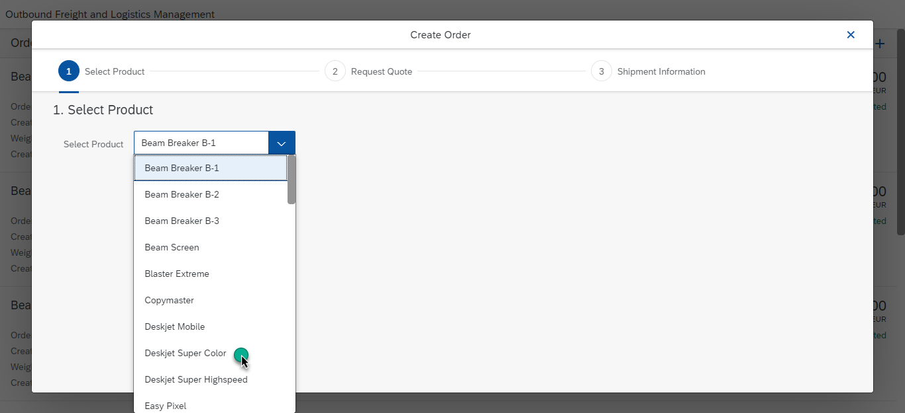
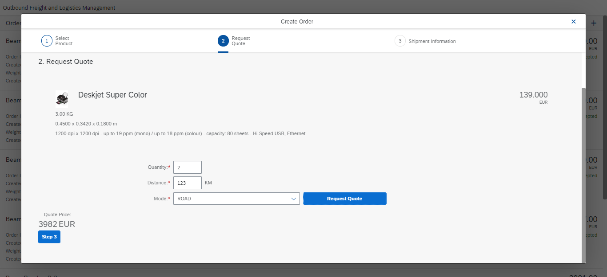
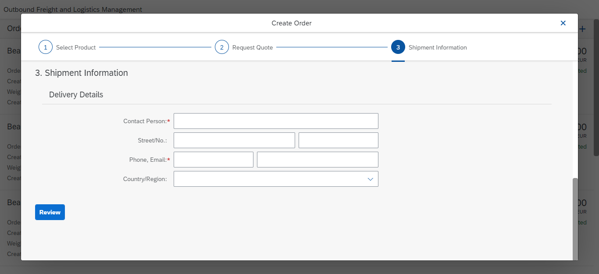
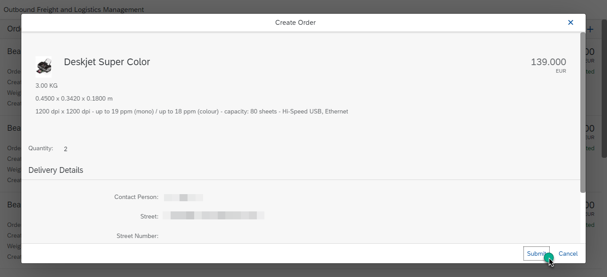
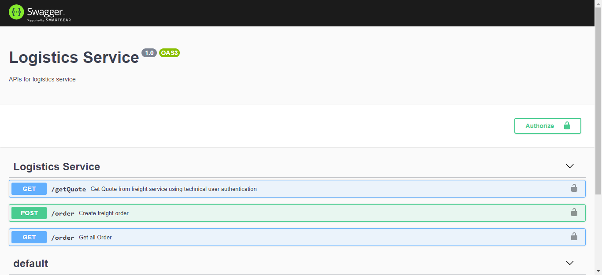
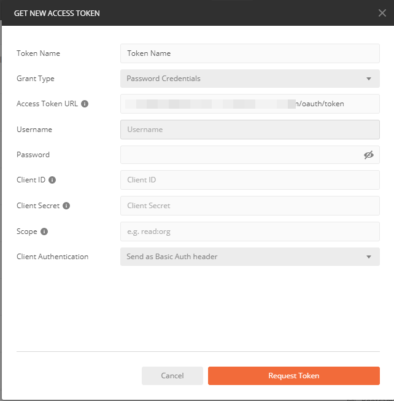
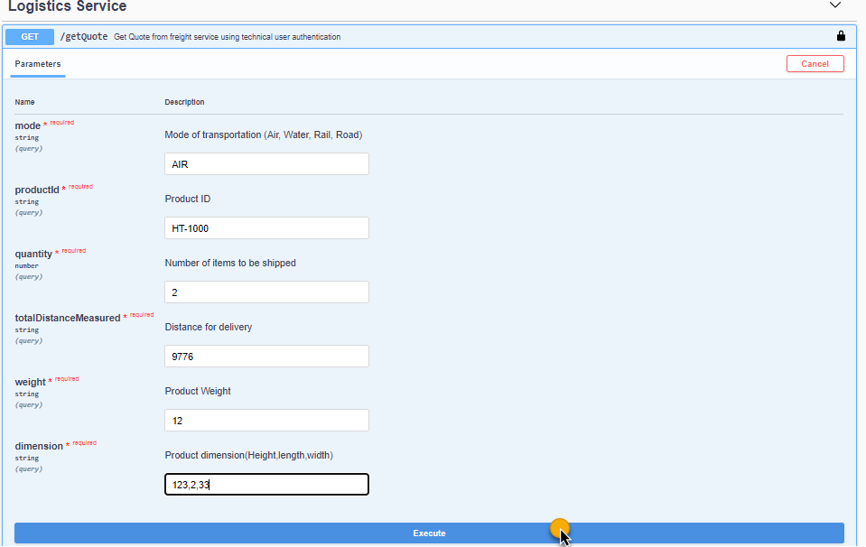
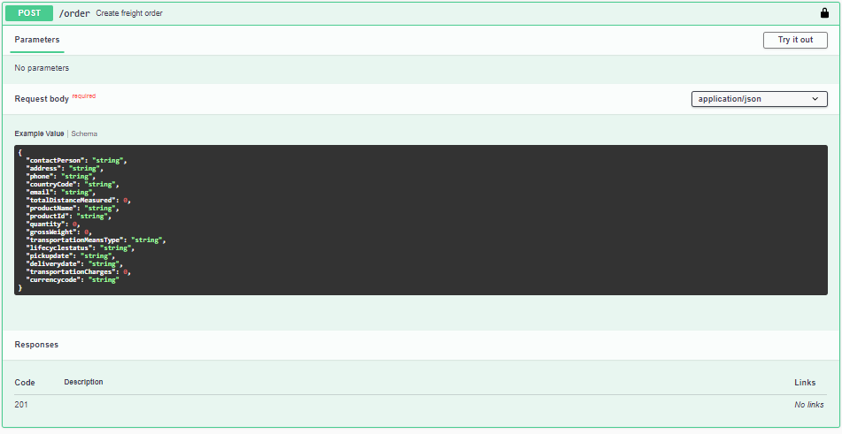

# Outbound Freight and Logistics Management
[](https://api.reuse.software/info/github.com/SAP-samples/cloud-nodejs-oflm)

## Description
This is a sample application that showcases how to build a secure cloud-native Node.js application. The application is secured using the SAP Cloud Platform Cloud Foundry environment [Authorization and Trust Management Service](https://help.sap.com/viewer/65de2977205c403bbc107264b8eccf4b/Cloud/en-US/6373bb7a96114d619bfdfdc6f505d1b9.html). The current scope of the application is to showcase the following capabilities of the Authorization and Trust Management service. 
- Authentication and authorization of users
- Secured service-to-service communications by propagating a business user
- Secured service-to-service communication using a technical user

These features are showcased through an Outbound Freight and Logistics Management Application. This application is based on shipment order creation for freight. As a supplier, he gets different quotations for different modes of transport and he chooses the best available quotation as per his needs. The application is developed based on microservices. The implementation is done using [SAP Cloud SDK](https://sap.github.io/cloud-sdk/docs/js/getting-started/) and [Nest.js](https://nestjs.com/) framework.

## Table of content
- [Outbound Freight and Logistics Management](#outbound-freight-and-logistics-management)
  - [Description](#description)
  - [Table of content](#table-of-content)
  - [Business Scenario](#business-scenario)
  - [Architecture](#architecture)
    - [Product Service](#product-service)
    - [Logistics Service](#logistics-service)
    - [External Freight Manager](#external-freight-manager)
    - [Authorization and Trust Management in the Cloud Foundry Environment](#authorization-and-trust-management-in-the-cloud-foundry-environment)
    - [HANA Database](#hana-database)
  - [Requirements](#requirements)
  - [Security Implementation](#security-implementation)
    - [Service communications by propagating a business user](#service-communications-by-propagating-a-business-user)
    - [Service-to-service communication using a technical user](#service-to-service-communication-using-a-technical-user)
  - [Implementing Authentication and Authorization](#implementing-authentication-and-authorization)
    - [Service-to-service communications by propagating a business user](#service-to-service-communications-by-propagating-a-business-user)
    - [Service-to-service communication using a technical user](#service-to-service-communication-using-a-technical-user-1)
  - [Deploying the application on SAP Cloud Platform Cloud Foundry Environment](#deploying-the-application-on-sap-cloud-platform-cloud-foundry-environment)
    - [Deploying the applications](#deploying-the-applications)
      - [Deployment Using Manifest](#deployment-using-manifest)
      - [Deployment using MTA](#deployment-using-mta)
  - [Demo Script](#demo-script)
  - [Swagger](#swagger)
  - [Known Issues](#known-issues)
  - [How to Obtain Support](#how-to-obtain-support)
  - [License](#license)

## Business Scenario
This reference application shows how the conventional freight and logistics process works. 
There are three services involved here. 
- The product and logistics service, which showcases how two services communicate with each other securely. The logistics service checks for product availability gets the product details.  
- The freight manager acts as an external vendor, who provides quotes for shipment, and once the order is placed, the shipment is taken care of by the freight-manager.  The communication between freight and logistics service represents technical user authentication. 

## Architecture


In the solution diagram we have the following components: 
- Product Service
- Logistics Service
- External Freight Manager Service
- Authorization and Trust Management
- HANA Database 

### Product Service
This microservice can be used to process products and stock information.

### Logistics Service
This service communicates securely with the Product Service (using business user propagation) and then consolidates the characteristics of the goods to be shipped. Then the service communicates securely with the freight manager service, which is an external service (using technical user communication) and gets a quotation for the shipment.

### External Freight Manager
This is a service external to the application which is used to calculate the shipment costs using a simple logic.
This service is also used in showcasing the app-to-app communication between two microservices deployed in the same subaccount, but bounded to two different Authorization and Trust Management services. For more information, see referencing the application in the documentation for SAP Cloud Platform.

### Authorization and Trust Management in the Cloud Foundry Environment
The global account and subaccounts get their users from identity providers. Administrators make sure that users can only access their dedicated subaccount by making sure that there is a dedicated trust relationship only between the identity providers and the respective subaccounts. Developers configure and deploy application-based security artifacts containing authorizations, and administrators assign these authorizations using the cockpit. [Read More](https://help.sap.com/viewer/65de2977205c403bbc107264b8eccf4b/Cloud/en-US/6373bb7a96114d619bfdfdc6f505d1b9.html)

### HANA Database
SAP HANA is a high-performance in-memory database that accelerates data-driven, real-time decision making and actions, and supports all workloads, with the broadest advanced analytics on multi-model data, on premise and in the cloud. [Read more](https://www.sap.com/products/hana.html)


## Requirements
- Install [Nodejs](https://nodejs.org/en/download/)
- Install [Visual Studio Code](https://code.visualstudio.com/download) or any of your preferred IDE.
- Install [SAP Cloud SDK](https://sap.github.io/cloud-sdk/docs/js/getting-started/) CLI globally 
    ```
    npm install -g @sap-cloud-sdk/cli
    ```
  The SAP Cloud SDK supports you end-to-end when developing applications that communicate with SAP solutions and services such as SAP S/4HANA Cloud, SAP SuccessFactors, and many others.

  Using the SDK, you can reduce your effort when developing an application on SAP Cloud Platform by building on best practices delivered by the SDK. The SDK can provide JavaScript libraries and project templates.

  To create such an application, it provides a command-line interface, that allows you to scaffold or enhance an application with the missing parts. To use the SDK: [Read More](https://sap.github.io/cloud-sdk/docs/js/getting-started/)


- Download and install [Cloud Foundry CLI](https://github.com/cloudfoundry/cli#downloads)

- NestJS is a progressive [Node.js](http://nodejs.org) framework for building efficient and scalable server-side applications, heavily inspired by [Angular](https://angular.io). 

- The [Nest CLI](https://docs.nestjs.com/cli/usages) is a powerful tool and can help you create new controllers, modules and interfaces.

- SAP Cloud Platform Subaccount with the following entitlements

| Service                           | Plan       | Number of Instances |
|-----------------------------------|------------|:-------------------:|
| SAP HANA Schemas & HDI Containers | hdi-shared |          1          |
| SAP Hana Service                  | 64standard |          1          |
| Application Runtime               |            |          1          |


## Security Implementation

The security implementation in the application is done using the Node-security libraries, which can be integrated with the SAP Cloud Platform Authorization and Trust Management service as described [here](https://help.sap.com/viewer/65de2977205c403bbc107264b8eccf4b/Cloud/en-US/4902b6e66cbd42648b5d9eaddc6a363d.html). This application implements app-to-app communication so that two microservices can securely communicate with each other. This application showcases how to implement secure communication in two  different ways:

- Service communications by propagating a business user
- Service-to-service communication using a technical user

### Service communications by propagating a business user

In this approach, the business user is authenticated and his authorizations are used to call another microservice. The user is therefore known to the microservice that it is calling.

### Service-to-service communication using a technical user

In this approach, a technical user is used to access data from an external application. The called application grants the calling application the necessary rights without identifying a user.


Both methods have their use cases, depending on whether or not one need to identify the business user and grant access based on his authorizations or using a technical user might be sufficient.


## Implementing Authentication and Authorization

The steps below describe how authentication and authorization is implemented in the ESPM application.

### Service-to-service communications by propagating a business user

As a pre prerequisite, the logistics-service and product-service should be bound to same xsuaa instance as they are part of the same application.

 1. Add the [application security descriptor](https://help.sap.com/viewer/65de2977205c403bbc107264b8eccf4b/Cloud/en-US/150b04d647cd4b42835411c1787a8b11.html) file (xs-security.json) to the project.
    > This file can be found in the root folder of the project.

 2. Define a role **Supplier** within the application security descriptor.
    
    Only a person assigned the **Supplier** role will be able to create a Shipment Order.

 3. Configure scope checks for validating JWT tokens.
 
    This is done in the logistics-service and product-service by using passport and xssec packages as described [here](https://help.sap.com/viewer/65de2977205c403bbc107264b8eccf4b/Cloud/en-US/dbd4c69eef5642d4a2ced0f6fc7a0415.html).
 
 4. Implement app-to-app communication for the business user in the getQuote method of product-service. 

 When a supplier logs in to create a shipment order, the business user is propagated from the logistics-service to product-service for a stock check before accepting the shipment order. This ensures that enough stock is available before a shipment order is accepted and only a user with the **Supplier** role has the permission to do a stock check.
 
 **Code Snippet**
 Implementation of a scope check can be accessed at the following 
 [line](/logistics-service/src/logistics/quote.controller.ts#L66-L68)

```
    const isAuthorized = req.authInfo.checkLocalScope('Supplier');
    // checks for authorization before executing next block, if unauthorized, returns exception
    if(isAuthorized){
```
The authentication token is fetched from request header at the following [line](/logistics-service/src/logistics/quote.controller.ts#L65)
```
const authorization = req.headers.authorization;
```
The business user authentication code snippet can be found at the following [line](/logistics-service/src/logistics/quote.service.ts#L67-L88)

 
 ### Service-to-service communication using a technical user
 
 App-to-app communication for the technical user is implemented between the logistics-service and the external freight-manager application using **client-credential flow**. The logistics-service and the external freight-manager application are bound to different XSUAA instances.
 1. The logistics-service is bound to the instance **businessuser-authentication**(which uses xs-security.json).
 
 2. The external freight-manager service is bound to the instance **freight-xsuaa**(which uses xs-security.json inside freightmanager directory).
 
 3. The freight-manager service grants a scope to the logistics-service using the property **"grant-as-authority-to-apps"** in the xs-security.json. This property has the value **["$XSAPPNAME(application,businessuser-authentication)"]** where businessuser-authentication is the xs-appname of the businessuser-authentication xsuaa service.
 
 4. The logistics-service accepts the granted authorities. This is achieved by the property **"$ACCEPT_GRANTED_AUTHORITIES"** in the xs-security.json. This ensures that the freightmanager-service trusts the logistics-service and hence technical user communication between the two services is achieved using client credentials flow.
 
 For more information, refer to section [referencing the application](https://help.sap.com/viewer/65de2977205c403bbc107264b8eccf4b/Cloud/en-US/517895a9612241259d6941dbf9ad81cb.html#loio517895a9612241259d6941dbf9ad81cb__section_fm2_wsk_pdb) in the documentation for SAP Cloud Platform.

**Code snippet of implementation**
In `xs-security.json` under `security-config` folder, the following line is added for establishing trust:
```
"authorities":["$ACCEPT_GRANTED_AUTHORITIES"]
```
The `xs-security.json` of `freight-manager` has the following implementation:
```
 "scopes": [
		{
			"name": "$XSAPPNAME.Access",
			"description": "access freight service ",
			"grant-as-authority-to-apps": ["$XSAPPNAME(application,businessuser-authentication)"]
		}
	]
    // Here at "grant-as-authority-to-apps" we pass the xs-app name, XSUAA service-plan of UAA for which we want to establish trust. 
```

Code snippet to generate authentication token for technical user authentication: 

To get the `client-id` and `client-secret` from the bound xsuaa service instance we use the following line of code:
```
import * as xsenv from '@sap/xsenv';
const xsCredentials = xsenv.cfServiceCredentials({tag: 'xsuaa'});    
/**
 * exports client credentials from vcap
 */
export const ServiceCredentials = [{ "clientId": xsCredentials.clientid, "clientSecret": xsCredentials.clientsecret,"url": xsCredentials.url }];

```
The credentials are then used for generating a bearer token which is used for authentication and authorization in the freight-manager.
```
 /**
     * This method is used to generate client credentials
     * @param clientCredentials XSUAA credentials returned from credentials provider
     */
    async getClientToken(clientCredentials: any) {
        return new Promise((resolve, reject) => {
            const url = `${clientCredentials.url}/oauth/token`;
            axios.post(url, `grant_type=client_credentials&client_id=${clientCredentials.clientId}&client_secret=${clientCredentials.clientSecret}`).then((res: any) => {
                resolve(res.data.access_token);
            }).catch((error: any) => {
                console.log(error);
                reject(error);
            });
        });
    }
```
The implementaion in project can be found [here](/logistics-service/src/logistics/quote.service.ts)


## Deploying the application on SAP Cloud Platform Cloud Foundry Environment

1. Clone the application.
2. Ensure you have cloud foundry CLI installed by typing `cf` in your command-prompt.
3. Log on to the Cloud Foundry environment using the following commands at the command prompt:
    ```
    cf api <api>
    cf login
    ```
    api - [URL of the Cloud Foundry landscape](https://help.sap.com/viewer/65de2977205c403bbc107264b8eccf4b/Cloud/en-US/350356d1dc314d3199dca15bd2ab9b0e.html) that you are trying to connect to.
    Enter username, password, org and space when prompted. For more information, see [link](https://help.sap.com/viewer/65de2977205c403bbc107264b8eccf4b/Cloud/en-US/75125ef1e60e490e91eb58fe48c0f9e7.html#loio4ef907afb1254e8286882a2bdef0edf4 ).


5. Go to the root of **freight-manager, product-service, logistics-service, approuter** and install the dependencies. 
   ```
   npm install
   ```
6. Open the directory `freight-manager` in your CLI and create an xsuaa instance with the following command.
    ```
    cf create-service xsuaa application freight-xsuaa -c xs-security.json
    ```
7. Open the directory `security-config` in your CLI and create an xsuaa instance with the following command.
    ```
    cf create-service xsuaa application businessuser-authentication -c xs-security.json
    ```
8. Navigate to your SAP Cloud Platform subaccount and open your development space.
9. For HANA Database instance  creation, follow the [documentation](https://help.sap.com/viewer/cc53ad464a57404b8d453bbadbc81ceb/Cloud/en-US/21418824b23a401aa116d9ad42dd5ba6.html).
10. Get the database ID using the following command.
    ```
     cf service <hana_db_instance_name> --guid
    ```
11. Give `nodeapp_db` as your HDI schema name. Follow the [document for creating a HDI Container](https://help.sap.com/viewer/cc53ad464a57404b8d453bbadbc81ceb/Cloud/en-US/93cdbb1bd50d49fe872e7b648a4d9677.html). 
12. Now open the db module in your command prompt and run the following command.
    ```
      cf push
    ```

### Deploying the applications 
For deployment, we have two options:
1. Deploy using Manifest.
2. Deploy using MTA.

#### Deployment Using Manifest
1. Go to the root directory of `freight-manager` and deploy it using the command:
    ```
    npm run deploy
    ```
2. Go to your SAP Cloud platform subaccount and navigate to the space where you are deploying the applications. 
4. Go to `Service Marketplace` and select `Destination`.
5. Go to Instances under destination and create a new instance.
6. Select plan `lite` and give it the name `freight-manager`.
7. Once the instance is created, open it. Go to  Destinations  and choose `New Destination`. 
8. Give it the name `freight-manager`. Paste the URL of the deployed `freight-manager` service.
9. Select `Authentication` as `No Authentication`. Your configuration should look like the following screenshot: 


10. Go to the root directory of `product-service` and deploy it using the command:
    ```
    npm run deploy
    ```
11. Copy the application URL of product-service once its deployed.
12. Open the `manifest.yaml` of `logistics-service` and replace `env` value with product-service URL. For reference check the screenshot below.


13. Open the root directory of `logistics-service` in your command prompt and deploy the application using the following command:
    ```
    npm run deploy
    ```
14. For deploying the UI and approuter, go to the `approuter` folder. Open `manifest.yaml`. 
15. Replace the values of `product-service` & `logistics-service` with the application URL of your deployed `product-service` and `logistics-service`. Replace the `api-endpoint` in tenant-host-pattern with the API endpoint of your subaccount. 
16. Now launch the deployed approuter application. This will return the error: `Forbidden`, since we don't have roles assigned to the user. We need to create a role collection and assign it to a user.
17. Go to your **subaccount > Role Collections** and choose **+** to create a role collection.
18. Give it a name. Now open it and choose **Edit**.
19. Under the **Roles** tab, choose **+** to add new role to the role collection.
20. From the Dropdown, select **Supplier roles**.
21. Goto **Users > +** and add your user.
22. Now launch the application and you are good to go.

#### Deployment using MTA

## Demo Script

To demo the application, you need to first launch the user interface application. 
- To get the application URL, run the following command: 
    `cf apps`
    This will give you a list of applications and their URLs. Pick the URL corresponding to `oflm-approuter`.
    To launch the UI, open the link of your `application-router`.
- Once the application is launched it will take you to the login page.


- Enter your credentials and you will be redirected to the application. The Homepage shows list of shipment orders, which were previously created. Here, to get the orders, business user authentication and authorization will take place.


- To create a new shipment order, choose **+** at the top-right corner. When you choose **+**, a dialog opens. You can see list of available products that can be shipped. To get the list of products, business user authentication takes place. The authentication token/bearer token from `logistics-service` is used to authenticate and authorize the `product-service`. The product list is then returned from `product-service`. Select one product from the drop-down. 


- After the product is selected, choose the Step-2 button. This takes you to the next section. You can see the selected product. Enter the shipment details like quantity, distance, and preferred mode of transportation. Then choose Request Quote. After choosing Request Quote, the `product-service` is called to check the availability of stock. At this step, business user authentication happens again to check stock. If the stock is there, then the client credentials of UAA bound to `logistics-service`, which is the `businessuser-authentication` UAA is used to generate an authentication token. The generated token is then used in authentication and authorization checks in the `freight-manager` service. 


- Once we get the quote price. Choose the Step-3 button. This takes you to the step where you need to enter the delivery details. 


- Enter the address and choose Review. You can see the selected product and its details, quote price, and delivery details. Choose Submit to create the order. 


The order is created and you see a success message. Next the order list is uploaded. 

## Swagger
The application also exposes a swagger definition for APIs. It can be accessed with the URL as described below: 
`<service-url>/api/`

The swagger UI: 



**Authorization**
You need to generate a bearer token and then use it to access the swagger. The configuration below can be used to generate a bearer token in postman. There's need of client-id, client-secret, and token-url. This information can be found in the xsuaa environment variables.



The token can be provided in swagger. 
Here's what the swagger definition looks like: 




## Known Issues

- Unable to find `nest` command.
    > Run `npm install` in the root of all the services.
- Unable to find module `request` or any other module.
    > Try deleting the `package-lock.json` and re-deploy.
- `404`/not-found in logs or UI
    > Ensure that you have correctly mentioned `product-service` URL in `logistics-service`. Ensure you have the correct URL in the destination service. Ensure the application router has the correct URL.


## How to Obtain Support

In case you find a bug, or you need additional support, please [open an issue](https://github.com/SAP-samples/cloud-nodejs-oflm/issues/new) here in GitHub.

## License
Copyright (c) 2020 SAP SE or an SAP affiliate company. All rights reserved. This project is licensed under the Apache Software License, version 2.0 except as noted otherwise in the [LICENSE](LICENSES/Apache-2.0.txt) file.
